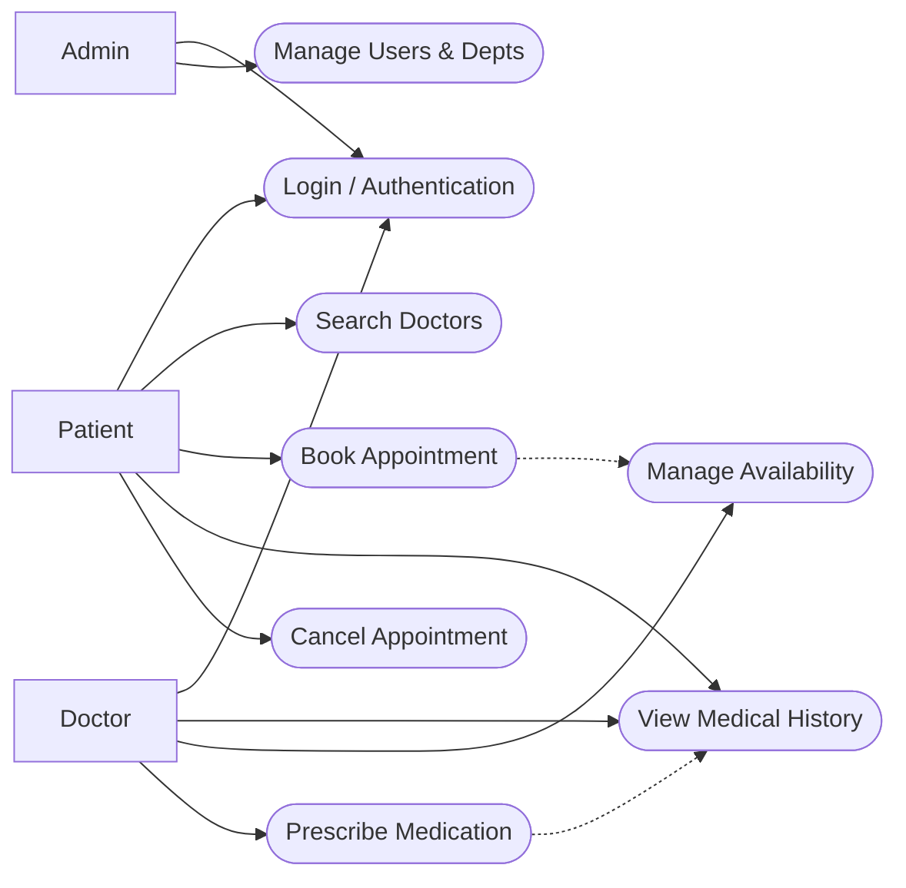

# Use Case Diagram
## Overview
This diagram outlines the primary interactions for the three main actors: **Patient**, **Doctor**, and **Admin**.

## Use Case Descriptions

| ID | Use Case | Actor | Description |
| --- | --- | --- | --- |
| **UC1** | Login / Auth | All | Secure JWT-based authentication for all user roles. |
| **UC3** | Book Appointment | Patient | Request a time slot; triggers availability check. |
| **UC5** | Manage Availability | Doctor | Toggle "On Duty" status to accept/reject new bookings. |
| **UC6** | Prescribe Meds | Doctor | Create a permanent medical record linked to an appointment. |

